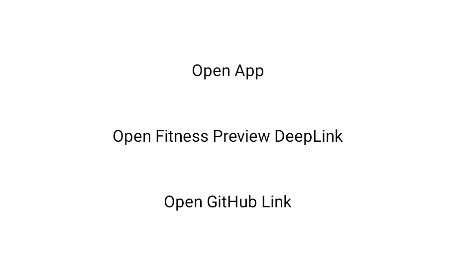
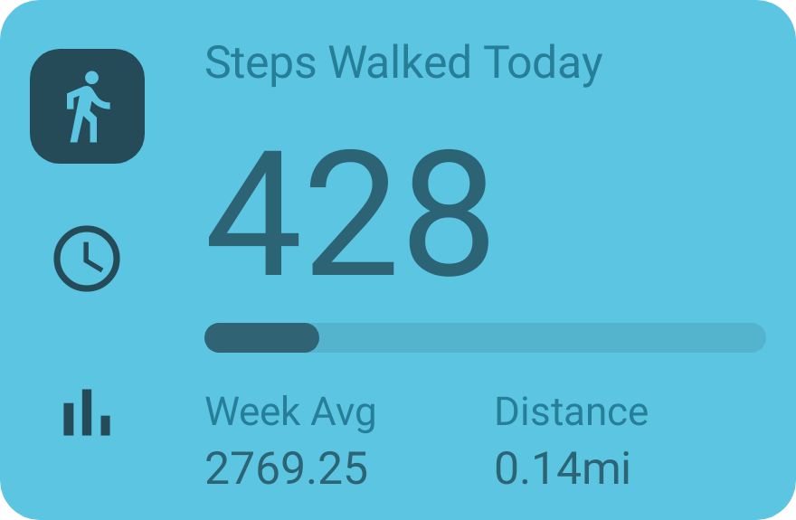
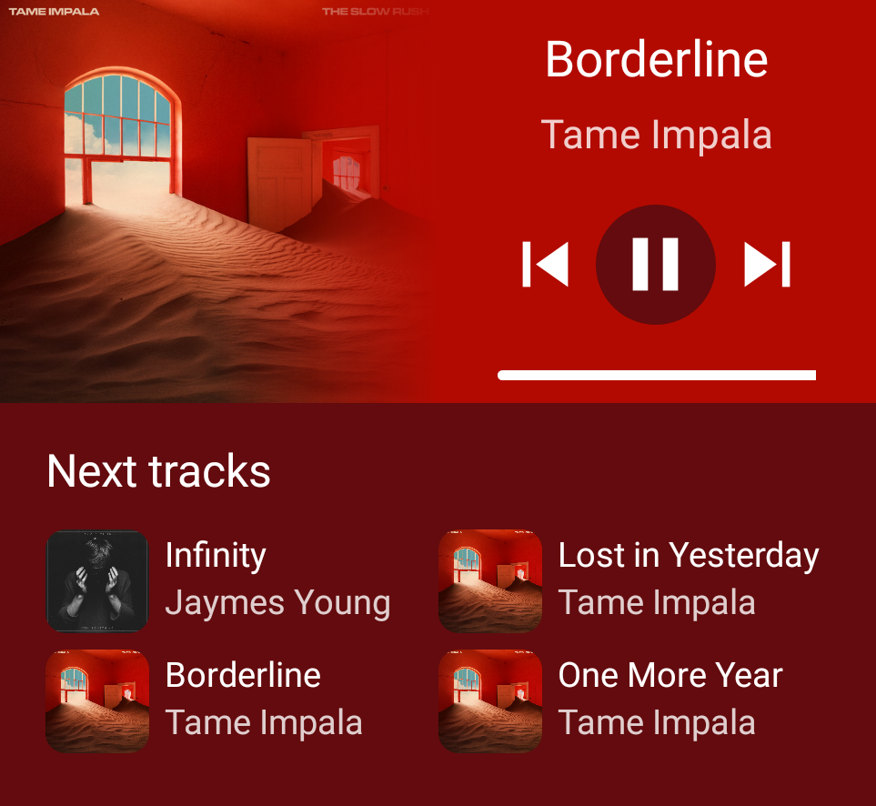
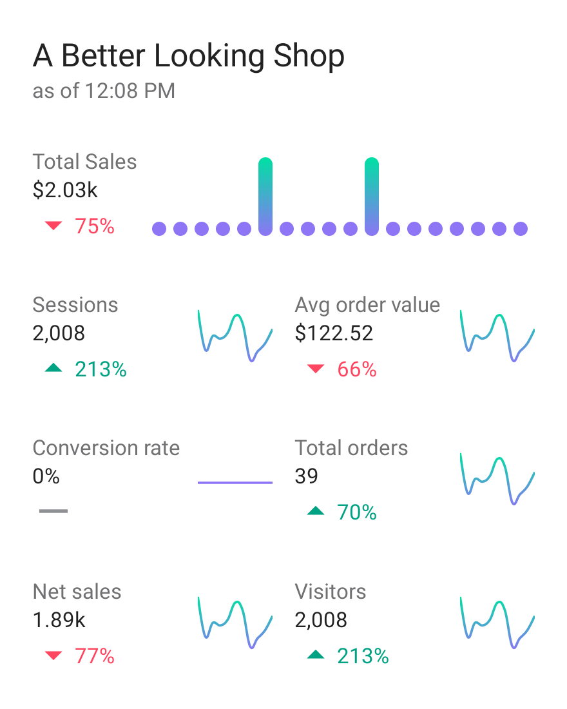

# Demo

You can download the demo app with the example widgets from the [Releases Page](https://github.com/sAleksovski/react-native-android-widget/releases)

## Click Demo Widget Preview

## Counter Widget Preview

## Fitness Widget Preview

## List Widget Preview

## Resizable Music Widget Preview

## Rotated Widget Preview

## Shopify Widget Preview

